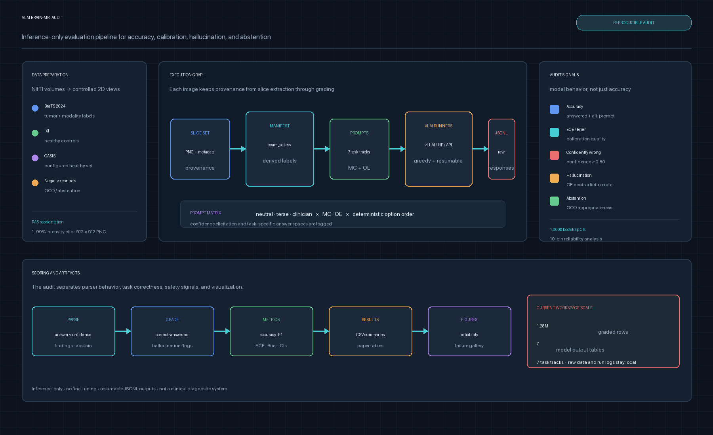
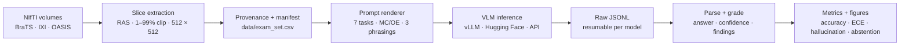

# VLM Brain-MRI Audit

**Suggested repository name:** `vlm-brain-mri-safety-audit`

**About:** An inference-only framework for auditing vision-language models on slice-level brain-MRI tasks, measuring accuracy, calibration, hallucination, confidence, and abstention.



## Overview

This project evaluates how well modern vision-language models interpret controlled brain-MRI views and how safely they communicate uncertainty. It is an **AI/ML evaluation pipeline**, not a training or fine-tuning project: model weights remain unchanged while the system measures task accuracy, confidence calibration, hallucinated findings, and appropriate abstention on out-of-distribution inputs.

The pipeline turns public neuroimaging volumes into reproducible 2D slices, derives labels from dataset metadata and segmentation masks, renders a fixed prompt matrix, runs local or API-based VLMs, parses structured signals from their responses, and produces statistical summaries and figures. The design keeps image provenance, prompt construction, model configuration, and grading decisions inspectable.

The project is intended for research on slice-level visual recognition and model safety behavior. It is not a clinical diagnostic system and should not be used to make decisions about patient care.

## Evaluation scope

The task registry in `config/tasks.yaml` defines seven evaluation tracks:

| Task | Question |
| --- | --- |
| `T1-MOD` | Which MRI modality or sequence is shown? |
| `T2-PLANE` | Is the slice axial, sagittal, or coronal? |
| `T3-ISBRAIN` | Is the image a brain MRI? |
| `T4-TUMOR` | Does the image show a tumor or gross abnormality? |
| `T5-LAT` | Where is an abnormality located: left, right, bilateral, or none? |
| `T6-VQA` | How does the model answer mixed image-grounded questions? |
| `T7-ABSTAIN` | Does the model recognize unsuitable or out-of-distribution inputs? |

Each applicable task can be evaluated with multiple-choice and open-ended prompts. Prompt phrasing is configurable (`neutral`, `terse`, or `clinician`), multiple-choice options are deterministically shuffled and logged, and every response includes an elicited confidence value when the model provides one.

## Data construction

The data pipeline supports:

- **BraTS 2024** volumes and segmentation masks for modality, tumor-presence, and laterality labels.
- **IXI** healthy-volunteer scans for non-tumor controls and metadata-based attributes.
- **OASIS** T1 scans as an additional configured healthy dataset.
- Generated or non-brain negative controls for abstention and out-of-distribution testing, including noise, blank, corrupted-MRI, and optional chest-X-ray examples.

`src/data/slice_extract.py` canonicalizes NIfTI orientation to RAS, applies a robust 1–99% intensity window, converts slices to 8-bit PNG, extracts axial/sagittal/coronal views at controlled depth fractions, and records provenance. `src/data/build_manifest.py` converts that provenance into `data/exam_set.csv`, deriving labels from filenames, masks, and metadata instead of requiring manual annotation.

The current workspace’s saved summary contains 1,350 BraTS slices from 150 subjects, 2,682 IXI slices from 100 subjects, and 70 negative controls. OASIS remains supported by configuration but only appears in a run when its source data is available.

## Pipeline



## Model backends

The registry in `config/models.yaml` is the single source of truth for model IDs, backends, precision, token limits, tiers, and optional runs.

- `src/inference/vllm_runner.py` runs supported open VLMs locally with batched, greedy decoding.
- `src/inference/hf_runner.py` provides a Transformers fallback for models that are not available through the vLLM path.
- `src/inference/api_runner.py` supports optional OpenAI, Google, and Anthropic providers with retries, caching, and refusal handling.
- `src/inference/run_inference.py` makes runs resumable by skipping completed `(model, image_id, prompt_id)` keys and can shard work across GPUs.

The model configuration includes general-purpose families such as Qwen, InternVL, Llama, and Gemma, medical models such as MedGemma and LLaVA-Med, and optional frontier API entries.

## Scoring and metrics

Responses are parsed by `src/scoring/parse.py` and graded by `src/scoring/grade.py`. The scoring layer separates an unparseable response or abstention from an ordinary wrong answer, which makes parser reliability and coverage visible instead of silently folding them into accuracy.

The analysis code reports:

- answered-item accuracy and all-prompt accuracy
- balanced accuracy and macro-F1
- expected calibration error (ECE) and Brier score
- mean confidence on wrong answers and confidently-wrong rate
- open-ended hallucination rate
- appropriate abstention on negative controls
- bootstrap confidence intervals using 1,000 resamples

`src/analysis/aggregate.py` writes CSV summaries, while `src/analysis/make_figures.py` creates reliability plots, task comparisons, failure galleries, and ablation figures.

## Quick start

The project targets Python 3.11 with PyTorch, CUDA-compatible inference libraries, the Hugging Face ecosystem, neuroimaging packages, and the analysis/test dependencies listed in `environment.yml` and `requirements.txt`.

```bash
git clone https://github.com/amir-sbg/vlm-brain-mri-audit.git
cd vlm-brain-mri-audit

conda env create -f environment.yml
conda activate vlmaudit
export PYTHONPATH="$PWD"

python -m pytest tests/test_parse.py -q
```

Before downloading data, verify which configured datasets are available:

```bash
python -m src.data.download \
  --check-only \
  --dataset brats ixi oasis
```

Build slices and a manifest after the source volumes are present:

```bash
python -m src.data.slice_extract \
  --config config/datasets.yaml \
  --dataset brats ixi oasis negative_controls \
  --output-dir data/slices \
  --provenance-out data/slice_provenance.jsonl

python -m src.data.build_manifest \
  --provenance data/slice_provenance.jsonl \
  --config config/datasets.yaml \
  --output data/exam_set.csv
```

Run a small local inference job by selecting a configured model:

```bash
python -m src.inference.run_inference \
  --models config/models.yaml \
  --tasks config/tasks.yaml \
  --prompts config/prompts.yaml \
  --manifest data/exam_set.csv \
  --output-dir raw_responses \
  --model Qwen/Qwen2.5-VL-3B-Instruct \
  --phrasing neutral \
  --format MC OE \
  --batch-size 8
```

Aggregate responses and generate figures:

```bash
python -m src.analysis.aggregate \
  --responses-dir raw_responses \
  --manifest data/exam_set.csv \
  --tasks config/tasks.yaml \
  --output-dir results

python -m src.analysis.make_figures \
  --results-dir results \
  --output-dir figures \
  --manifest data/exam_set.csv
```

For the cluster workflow, review the site-specific paths, account, partition, node, and conda location in `slurm/run_all.slurm` before submitting:

```bash
sbatch slurm/run_all.slurm
```

The launcher is idempotent at the stage level and inference outputs are resumable. Gated Hugging Face models require an accepted model agreement and `HF_TOKEN`; API-backed models require the corresponding provider key. Keep credentials in the environment, never in configuration files or Git.

## Reproducibility and engineering choices

- Dataset subsampling and negative-control generation use explicit seeds in `config/datasets.yaml`.
- Model IDs, prompt templates, task answer spaces, and dataset paths are configuration-driven.
- Multiple-choice option order is randomized deterministically and recorded for grading.
- Each model writes an independent JSONL stream, allowing failed workers to resume without duplicating completed items.
- Parser tests run before the full SLURM sweep.
- Raw data, model caches, responses, generated results, figures, logs, W&B runs, and internal collaboration notes are excluded by `.gitignore`; they can be regenerated or kept on the research server without bloating the source repository.

## Project structure

```text
.
├── config/
│   ├── datasets.yaml       # datasets, sampling, label sources
│   ├── models.yaml         # model registry and runtime settings
│   ├── prompts.yaml        # system prompt and phrasing templates
│   └── tasks.yaml          # task taxonomy and answer spaces
├── docs/
│   └── pipeline-overview.png
├── slurm/                  # cluster launchers
├── src/
│   ├── analysis/            # aggregation and figures
│   ├── data/                # download, extraction, manifests
│   ├── inference/           # vLLM, Transformers, and API runners
│   ├── prompts/             # prompt rendering
│   ├── scoring/             # parsing, grading, metrics
│   └── utils/               # configuration, logging, seeds, W&B
├── tests/
├── environment.yml
├── requirements.txt
└── README.md
```
