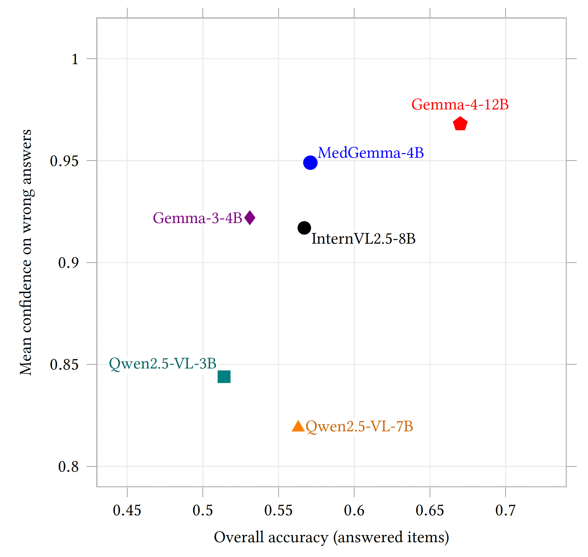

# Confident but Unreliable: VLM Brain MRI Safety Audit

<p align="center">
  
  &nbsp;&nbsp;&nbsp;
  
  &nbsp;&nbsp;&nbsp;
  
</p>

Research code for **"Confident but Unreliable: A Behavioral Safety Audit of Vision-Language Models on Brain MRI"**, accepted to [ACM AI 2026](https://aisummit.acm.org/).

This repository implements an inference-only evaluation pipeline for auditing vision-language models on controlled brain-MRI tasks. It converts public neuroimaging volumes into slice-level prompts, runs local or API-based VLMs, parses answers and stated confidence, and reports safety-relevant behavior beyond accuracy: calibration, high-confidence errors, hallucination, and abstention on non-brain controls.

The project was developed in the TReNDS research environment with Georgia Tech and Georgia State University collaborators. It is a model-evaluation framework, not a clinical diagnostic system.

<p align="center">
  
</p>

## Key Idea

Medical-image VLMs can sound confident even when they are wrong. This audit separates **task accuracy** from **confidence reliability**, so a model is not treated as safer just because it answers more questions correctly. In the accepted study, the most accurate audited model was also the most confident on its incorrect answers.

## What It Evaluates

The main automatically graded tasks are:

| Task | Description |
| --- | --- |
| `T1-MOD` | MRI modality or sequence recognition |
| `T2-PLANE` | axial, sagittal, or coronal plane recognition |
| `T3-ISBRAIN` | brain-MRI versus non-brain input |
| `T4-TUMOR` | visible tumor or abnormality detection |
| `T5-LAT` | lesion laterality: left, right, bilateral, or none |

The repository also supports configurable VQA and abstention tracks for broader experiments.

## Data and Labels

The pipeline supports BraTS, IXI, optional OASIS data, and generated or non-brain negative controls. Labels are derived from acquisition metadata, slice geometry, data source, and segmentation masks rather than new manual annotation.

This keeps the audit reproducible and slice-specific: tumor presence and laterality are graded only from the visible slice, not from subject-level labels.

## Pipeline

1. Extract normalized 2D slices from NIfTI volumes.
2. Build a manifest with slice provenance and labels.
3. Render deterministic multiple-choice and open-ended prompts.
4. Run VLM inference with vLLM, Hugging Face Transformers, or API backends.
5. Parse answers, confidence values, findings, refusals, and abstentions.
6. Aggregate accuracy, calibration, confident-error, hallucination, and abstention metrics.
7. Generate reliability figures for analysis and reporting.

## Quick Start

```bash
git clone https://github.com/amir-sbg/confident-unreliable-vlm-brain-mri-audit.git
cd confident-unreliable-vlm-brain-mri-audit

conda env create -f environment.yml
conda activate vlmaudit
export PYTHONPATH="$PWD"

python -m pytest tests/test_parse.py -q
```

Check dataset availability:

```bash
python -m src.data.download \
  --check-only \
  --dataset brats ixi oasis
```

Build slices and the exam manifest:

```bash
python -m src.data.slice_extract \
  --config config/datasets.yaml \
  --dataset brats ixi oasis negative_controls \
  --output-dir data/slices \
  --provenance-out data/slice_provenance.jsonl

python -m src.data.build_manifest \
  --provenance data/slice_provenance.jsonl \
  --config config/datasets.yaml \
  --output data/exam_set.csv
```

Run one configured model:

```bash
python -m src.inference.run_inference \
  --models config/models.yaml \
  --tasks config/tasks.yaml \
  --prompts config/prompts.yaml \
  --manifest data/exam_set.csv \
  --output-dir raw_responses \
  --model Qwen/Qwen2.5-VL-3B-Instruct \
  --phrasing neutral \
  --format MC OE \
  --batch-size 8
```

Aggregate responses:

```bash
python -m src.analysis.aggregate \
  --responses-dir raw_responses \
  --manifest data/exam_set.csv \
  --tasks config/tasks.yaml \
  --output-dir results
```

Cluster launchers are available in `slurm/` for larger sweeps.

## Repository Structure

```text
.
├── config/          # datasets, models, prompts, tasks
├── docs/            # README figures
├── slurm/           # cluster launch scripts
├── src/
│   ├── analysis/    # aggregation and figure generation
│   ├── data/        # download checks, slice extraction, manifests
│   ├── inference/   # vLLM, Transformers, and API runners
│   ├── prompts/     # prompt rendering
│   ├── scoring/     # parsing, grading, metrics
│   └── utils/
├── tests/
├── environment.yml
└── requirements.txt
```
